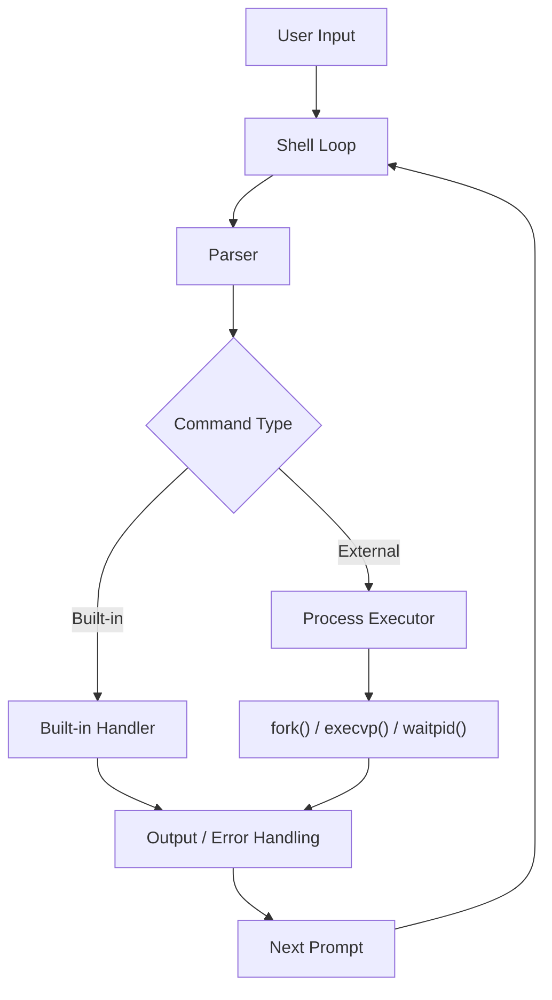

# Mini Shell Architecture

This diagram illustrates the high-level flow of our Mini Shell. The shell reads user input, parses the command, and dispatches it to the appropriate handler.

```mermaid
flowchart TD
    A["User Input"] --> B["Shell Loop"]
    B --> C["Parser"]
    C --> D{"Command Type"}

    D -->|Built-in| E["Built-in Handler"]
    D -->|External| F["Process Executor"]

    E --> G["Output / Error Handling"]
    F --> H["fork() / execvp() / waitpid()"]
    H --> G

    G --> I["Next Prompt"]
    I --> B
```
